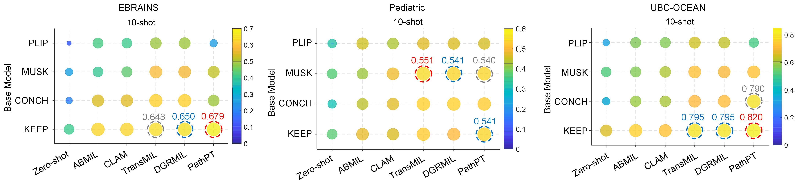

# PathPT (Pathology Prompt-Tuning)
The official code for **"Boosting Pathology Foundation Models via Few-shot Prompt-tuning for Rare Cancer Subtyping"**

[Preprint](https://arxiv.org/abs/2508.15904) | [Cite](#reference)

---

**Abstract:** Rare cancers comprise 20–25% of all malignancies but face major diagnostic challenges due to limited expert availability—especially in pediatric oncology, where they represent over 70% of cases. While pathology vision-language (VL) foundation models show promising zero-shot capabilities for common cancer subtyping, their clinical performance for rare cancers remains limited. Existing multi-instance learning (MIL) methods rely only on visual features, overlooking cross-modal knowledge and compromising interpretability critical for rare cancer diagnosis.

To address this limitation, we propose **PathPT**, a novel framework that aims to fully harness the potential of pre-trained vision-language models via spatially-aware visual aggregation and task-specific prompt tuning. Unlike conventional MIL, PathPT converts WSI-level supervision into fine-grained tile-level guidance by leveraging VL models’ zero-shot abilities, thereby preserving localization on cancerous regions and enabling cross-modal reasoning through prompts aligned with histopathological semantics. We benchmark PathPT on eight rare cancer datasets (four adult, four pediatric) spanning 56 subtypes and 2,910 WSIs, as well as three common cancer datasets, evaluating four state-of-the-art VL models and four MIL frameworks under three few-shot settings. Results show that PathPT consistently delivers superior performance, achieving substantial gains in subtyping accuracy and cancerous region grounding ability. This work advances AI-assisted diagnosis for rare cancers, offering a scalable solution for improving subtyping accuracy in settings with limited access to specialized expertise.

---

## Key Insights


**PathPT** introduces a novel prompt-tuning framework that enhances pathology foundation models for rare cancer subtyping by fully leveraging pre-trained vision-language capabilities.

**🔹 Cross-modal Knowledge Integration**: Unlike conventional MIL methods, PathPT harnesses semantic knowledge embedded in text encoders through prompt learning, enabling cross-modal reasoning.

**🔹 Spatially-Aware Visual Aggregation**: We design a spatial-aware module that enhances the locality of visual patch features, preserving crucial spatial relationships and contextual information.

**🔹 Fine-grained Interpretable Grounding**: By leveraging foundation models' zero-shot capabilities, PathPT converts WSI-level supervision into fine-grained tile-level guidance, achieving superior localization on cancerous regions with enhanced interpretability compared to traditional approaches.


## Quick Start
1. Download base model, such as KEEP from [KEEP](https://huggingface.co/Astaxanthin/KEEP) and place the model folder into ./base_models
2. Download tile-level features of WSIs, such as TCGA-UCS extracted using KEEP at [UCS-KEEP-feature](https://drive.google.com/file/d/1RNSIINkumfhiyqwL82hUXALCtdyPhbC3/view?usp=sharing) and place the unziped folder into ./features/keep/ucs/h5_files
3. Create a conda env and run script
 ```bash
conda create -n pathpt python=3.8 -y
conda activate pathpt
pip install -r requirements.txt

python train.py
```

## Customizing
Want to use your custom pathology datasets or other foundation models? Coming soon.


## Benchmark
We benchmarked 4 MILs and PathPT on 11 datasets, covering 4 rare adult cancers, 4 rare pediatric cancers, and 3 common cancers, based on foundation models: PLIP, MUSK, CONCH, and KEEP.



### Results on ERBAINS
| **Model** | **zero-shot** | **ABMIL** | **CLAM** | **TransMIL** | **DGRMIL** | **PathPT** |
|:---------:|:-------------:|:---------:|:--------:|:------------:|:----------:|:----------:|
| **PLIP**  | 0.111         | 0.419     | 0.410    | 0.488        | 0.491      | 0.251      |
| **MUSK**  | 0.253         | 0.403     | 0.442    | 0.582        | 0.569      | 0.519      |
| **CONCH** | 0.204         | 0.542     | 0.549    | 0.621        | 0.621      | 0.491      |
| **KEEP**  | 0.408         | 0.631     | 0.629    | 0.648        | 0.650      | **0.679**      |

### Results on Neuroblastoma
| **Model** | **zero-shot** | **ABMIL** | **CLAM** | **TransMIL** | **DGRMIL** | **PathPT** |
|:---------:|:-------------:|:---------:|:--------:|:------------:|:----------:|:----------:|
| **PLIP**  | 0.395         | 0.530     | 0.496    | 0.578        | 0.578      | 0.501      |
| **MUSK**  | 0.427         | 0.554     | 0.513    | 0.605        | 0.585      | 0.554      |
| **CONCH** | 0.353         | 0.431     | 0.496    | 0.572        | 0.578      | 0.493      |
| **KEEP**  | 0.551         | 0.513     | 0.497    | 0.566        | 0.541      | **0.583**      |


### Results on UBC-OCEAN
| **Model** | **zero-shot** | **ABMIL** | **CLAM** | **TransMIL** | **DGRMIL** | **PathPT** |
|:---------:|:-------------:|:---------:|:--------:|:------------:|:----------:|:----------:|
| **PLIP**  | 0.320         | 0.565     | 0.570    | 0.645        | 0.630      | 0.510      |
| **MUSK**  | 0.520         | 0.570     | 0.610    | 0.720        | 0.700      | 0.730      |
| **CONCH** | 0.375         | 0.590     | 0.605    | 0.710        | 0.715      | 0.790      |
| **KEEP**  | 0.660         | 0.755     | 0.730    | 0.795        | 0.795      | **0.820**      |


Results (balanced accuracy) demonstrate PathPT achieves superior performance over traditional MIL frameworks. Detailed results and analysis can be found in our [paper](https://arxiv.org/abs/2508.15904).


## Acknowledgment
The project was built on top of repositories such as [CLAM](https://github.com/mahmoodlab/CLAM), [CoOp](https://github.com/KaiyangZhou/CoOp) and [TransMIL](https://github.com/szc19990412/TransMIL). We thank the authors and developers for their contribution.

## Reference
If you find our work useful in your research, please consider citing our [paper](https://arxiv.org/abs/2508.15904):

```
@misc{he2025boostingpathologyfoundationmodels,
      title={Boosting Pathology Foundation Models via Few-shot Prompt-tuning for Rare Cancer Subtyping}, 
      author={Dexuan He and Xiao Zhou and Wenbin Guan and Liyuan Zhang and Xiaoman Zhang and Sinuo Xu and Ge Wang and Lifeng Wang and Xiaojun Yuan and Xin Sun and Yanfeng Wang and Kun Sun and Ya Zhang and Weidi Xie},
      year={2025},
      eprint={2508.15904},
      archivePrefix={arXiv},
      primaryClass={cs.CV},
      url={https://arxiv.org/abs/2508.15904}, 
}
```


 
